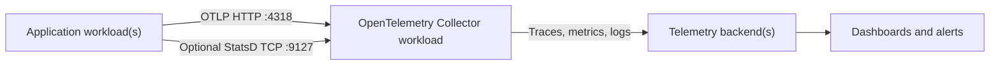
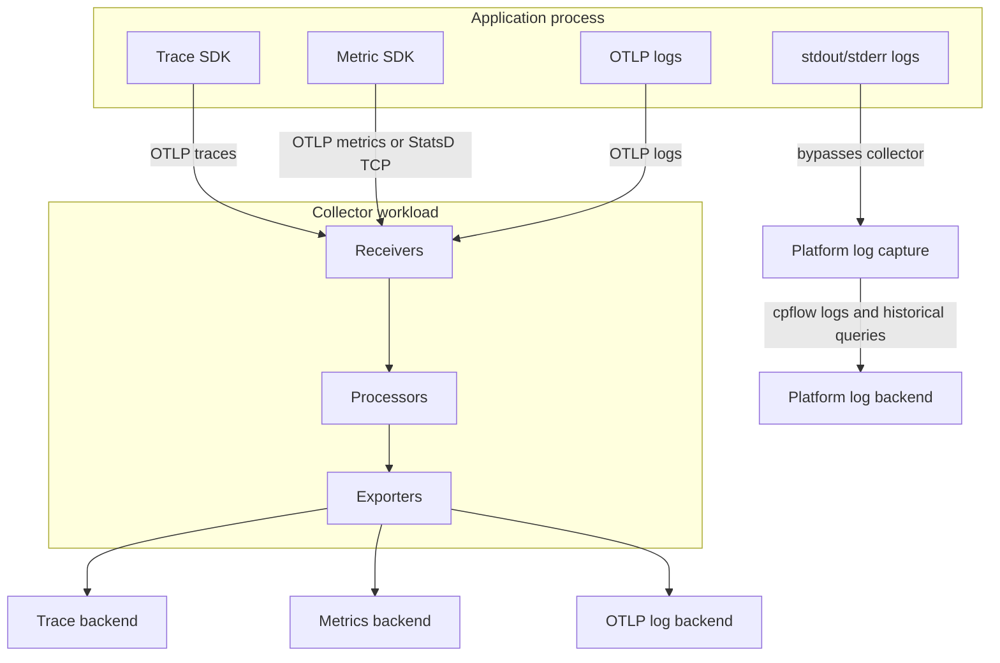

# Telemetry

This guide explains how to run application telemetry on Control Plane with
`cpflow`. It is intentionally generic: the examples use placeholder service
names, simple metric names, and backend-neutral collector configuration.

`cpflow` does not instrument application code. It helps deploy the Control Plane
workloads and environment values that already-instrumented applications use to
send traces, metrics, and logs.

## Quick Navigation

| Page | Use it for |
| --- | --- |
| [Collector workload](collector.md) | Control Plane workload template, collector ports, and matching `config.yaml` |
| [Application instrumentation](application-instrumentation.md) | Generic app env vars and simple Ruby/Node examples |
| [Pipelines](pipelines.md) | Receivers, processors, exporters, and how signals flow |
| [Review apps](review-apps.md) | Review-app isolation, sampling, secrets, and egress controls |
| [Troubleshooting](troubleshooting.md) | Commands and checks for missing telemetry |

## Recommended Shape

Keep the collector inside the same GVC as the application unless your team has a
separate, intentionally shared telemetry GVC. A same-GVC collector keeps review,
staging, and production wiring easy to reason about and avoids accidental
cross-environment data mixing.

## What `cpflow` Provides

`cpflow apply-template` already applies ordinary Control Plane workload
templates from `.controlplane/templates`. Telemetry can therefore be added with
project templates and app environment values; no custom `cpflow telemetry`
command is required.

Use `cpflow` for:

1. Deploying an OpenTelemetry Collector workload template.
2. Applying GVC or workload environment variables that point apps at the
   collector.
3. Reusing the same setup shape for review, staging, and production apps.
4. Tailing application and collector logs with `cpflow logs`.

Application code is still responsible for:

1. Installing OpenTelemetry, StatsD, Prometheus, or framework-specific
   instrumentation libraries.
2. Setting service names and resource attributes.
3. Creating custom spans or metrics.
4. Filtering sensitive data before it leaves the process.

## Signal Flow

stdout/stderr logs bypass the collector and are captured directly by the
platform. Use `cpflow logs` for live tailing.

For new instrumentation, prefer OTLP over HTTP on port `4318`. It is the most
portable path because it can carry traces, metrics, and logs through one
well-known protocol. Use StatsD only when your application already has a simple
StatsD client or when a metric library cannot emit OTLP yet.

## Minimal Rollout Checklist

1. Add `.controlplane/templates/open-telemetry-collector.yml`.
2. Package a collector `config.yaml` that binds every port exposed by the
   workload template.
3. Add the collector template to `setup_app_templates`.
4. Add the collector to `additional_workloads`.
5. Set application env vars such as `OTEL_SERVICE_NAME`,
   `OTEL_EXPORTER_OTLP_ENDPOINT`, and `OTEL_EXPORTER_OTLP_PROTOCOL`.
6. Apply the collector template with
   `cpflow apply-template open-telemetry-collector -a $APP_NAME`. For a
   brand-new app, `cpflow setup-app` applies it with the other configured
   templates.
7. Confirm collector logs, application exporter logs, and backend ingestion.

The collector workload and its `config.yaml` must be kept in sync. If the
workload exposes `4318`, `9127`, or `9292`, the collector config must bind those
same ports. Exposing a port in Control Plane does not automatically enable a
collector receiver or exporter.

## Generic Naming

Use names that describe the application or workload without leaking
environment-specific details.

Good examples:

- `example-web`
- `example-worker`
- `example.tasks.completed`
- `example.jobs.duration_ms`
- `deployment.environment=staging`

Avoid examples that include real company names, user IDs, request IDs, raw URLs,
or domain-specific nouns that only make sense in one business.

## More Detail

Start with [Collector workload](collector.md), then read
[Application instrumentation](application-instrumentation.md). Use
[Troubleshooting](troubleshooting.md) when signals do not appear in the backend.
