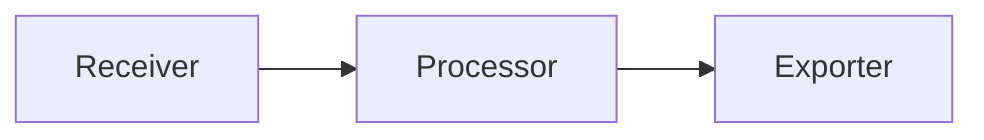
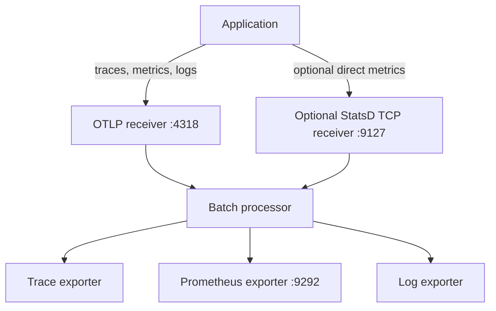

# Telemetry Pipelines

Collectors organize telemetry into signal-specific pipelines. Each pipeline has
receivers, optional processors, and exporters.

## Pipeline Components

| Component | Role | Examples |
| --- | --- | --- |
| Receiver | Accepts telemetry from apps | OTLP HTTP, StatsD TCP |
| Processor | Modifies, batches, filters, or samples telemetry | `batch`, `memory_limiter`, `attributes` |
| Exporter | Sends telemetry to a backend or exposes it for scrape | OTLP exporter, Prometheus exporter, debug exporter |

## Recommended Initial Pipelines

Start with direct application telemetry:

1. OTLP traces from the app SDK.
2. OTLP metrics from the app SDK, or StatsD TCP if that is what the app already
   supports.
3. Structured logs to stdout/stderr, or OTLP logs if your logging library
   supports them.

## Direct Metrics First

Prefer direct metrics from application code when you can change the code. Direct
metrics are explicit, cheap, and easy to test.

Good direct metrics:

- `example.requests.completed`
- `example.jobs.duration_ms`
- `example.queue.depth`
- `example.cache.hit`

Use low-cardinality labels such as:

- `status`
- `route_name`
- `worker`
- `deployment.environment`

## Derived Metrics

Derived metrics can be useful, but they should not be the default for new work.

| Source | Use when | Caution |
| --- | --- | --- |
| Spans | You already have spans and need latency/error histograms | Attribute choices can create high cardinality |
| Logs | You cannot change legacy code yet | Regex processing is expensive and fragile |

When a derived metric proves valuable, prefer moving it into direct application
instrumentation later.

## Sampling

Sampling belongs in the collector when you need centralized control. A common
policy shape is:

1. Keep all error traces.
2. Keep a small percentage of fast successful traces.
3. Keep a larger percentage of slow successful traces.

Record sampling decisions in the collector config so agents and humans know why
some traces are absent.
