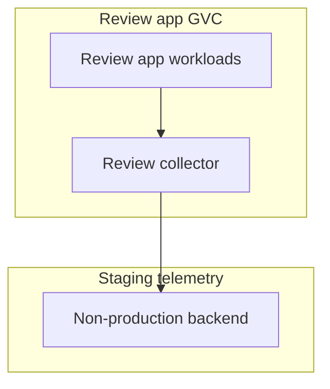

# Review Apps

Review-app telemetry should help debug a change without giving untrusted or
short-lived environments access to production telemetry credentials.



## Recommended Defaults

1. Use a collector inside each review app GVC, or a staging-only shared collector
   that is intentionally isolated from production.
2. Keep collector inbound access internal with `same-gvc` when the collector is
   inside the review app GVC. For a staging-only shared collector in another
   GVC, configure explicit cross-GVC ingress instead of broad public access.
3. Do not give review apps production telemetry tokens.
4. Use lower sampling rates and shorter retention for review apps.
5. Avoid sending request bodies, credentials, or personally identifiable
   information in spans, labels, or logs.
6. Restrict outbound egress to the non-production telemetry backend.

## Environment Separation

Use resource attributes to make review telemetry easy to filter:

```yaml
env:
  - name: OTEL_RESOURCE_ATTRIBUTES
    value: "deployment.environment=review,service.namespace=example"
```

If every review app has a unique name, keep that name in a bounded attribute only
when your backend can handle the cardinality. Do not put pull request titles,
branch names, user names, or request IDs into metric labels.

## Secrets

Store backend tokens in Control Plane secrets and bind only the collector
identity that needs them. See [Secrets and ENV Values](../secrets-and-env-values.md)
for the general Control Plane secret pattern.

Review apps should use non-production tokens. If no non-production token exists,
keep telemetry local to logs until one is available.
