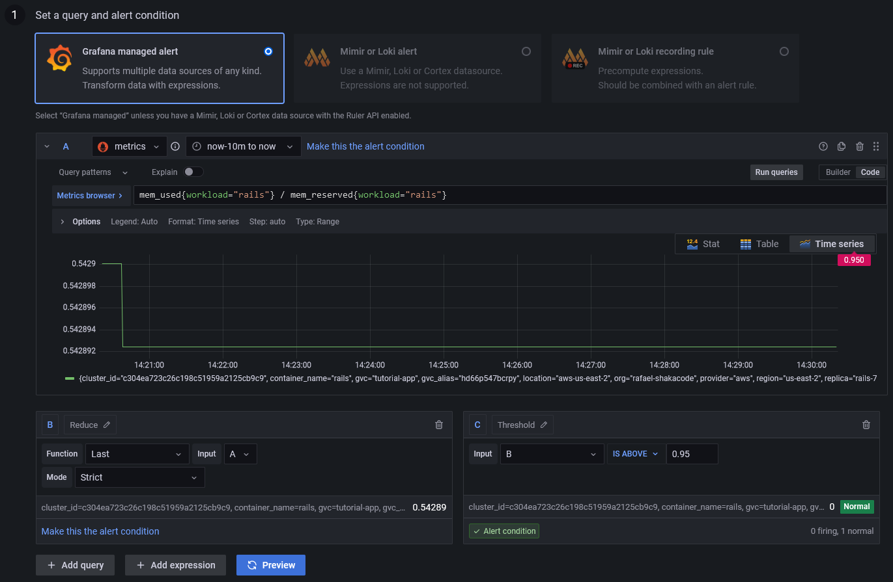
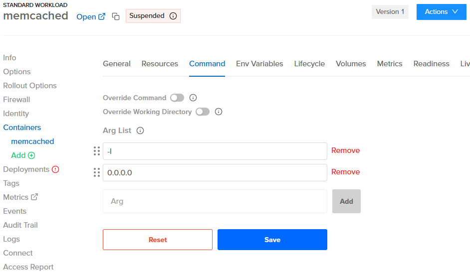
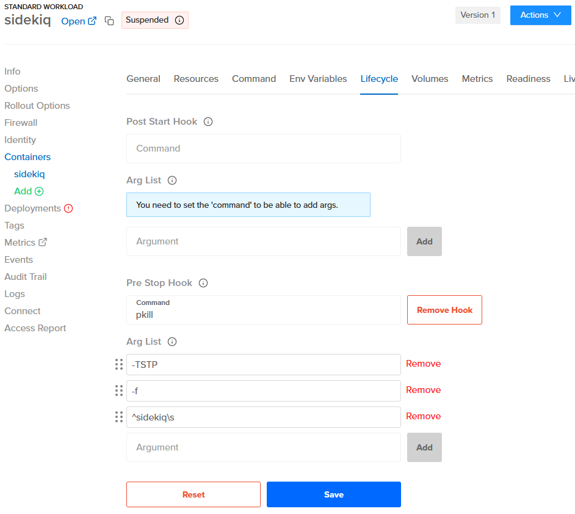

# Tips

1. [GVCs vs. Orgs](#gvcs-vs-orgs)
2. [RAM](#ram)
3. [Remote IP](#remote-ip)
4. [ENV Values](#env-values)
5. [CI](#ci)
6. [Memcached](#memcached)
7. [Sidekiq](#sidekiq)
   - [Quieting Non-Critical Workers During Deployments](#quieting-non-critical-workers-during-deployments)
   - [Setting Up a Pre Stop Hook](#setting-up-a-pre-stop-hook)
   - [Setting Up a Liveness Probe](#setting-up-a-liveness-probe)
8. [Useful Links](#useful-links)

## GVCs vs. Orgs

- A "GVC" roughly corresponds to a Heroku "app."
- Images are available at the org level.
- Multiple GVCs within an org can use the same image.
- You can have different images within a GVC and even within a workload. This flexibility is one of the key differences
  compared to Heroku apps.

## RAM

Any workload replica that reaches the max memory is terminated and restarted. You can configure alerts for workload
restarts and the percentage of memory used in the Control Plane UX.

Here are the steps for configuring an alert for the percentage of memory used:

1. Navigate to the workload that you want to configure the alert for
2. Click "Metrics" on the left menu to go to Grafana
3. On Grafana, go to the alerting page by clicking on the alert icon in the sidebar
4. Click on "New alert rule"
5. In the "Set a query and alert condition" section, select "Grafana managed alert"
6. There should be a default query named `A`
7. Change the data source of the query to `metrics`
8. Click "Code" on the top right of the query and enter `mem_used{workload="workload_name"} / mem_reserved{workload="workload_name"} * 100`
   (replace `workload_name` with the name of the workload)
9. There should be a default expression named `B`, with the type `Reduce`, the function `Last`, and the input `A` (this
   ensures that we're getting the last data point of the query)
10. There should be a default expression named `C`, with the type `Threshold`, and the input `B` (this is where you
    configure the condition for firing the alert, e.g., `IS ABOVE 95`)
11. You can then preview the alert and check if it's firing or not based on the example time range of the query
12. In the "Alert evaluation behavior" section, you can configure how often the alert should be evaluated and for how
    long the condition should be true before firing (for example, you might want the alert only to be fired if the
    percentage has been above `95` for more than 20 seconds)
13. In the "Add details for your alert" section, fill out the name, folder, group, and summary for your alert
14. In the "Notifications" section, you can configure a label for the alert if you're using a custom notification policy,
    but there should be a default root route for all alerts
15. Once you're done, save and exit in the top right of the page
16. Click "Contact points" on the top menu
17. Edit the `grafana-default-email` contact point and add the email where you want to receive notifications
18. You should now receive notifications for the alert in your email



The steps for configuring an alert for workload restarts are almost identical, but the code for the query would be
`container_restarts`.

For more information on Grafana alerts, see: https://grafana.com/docs/grafana/latest/alerting/

## Remote IP

The actual remote IP of the workload container is in the 127.0.0.x network, so that will be the value of the
`REMOTE_ADDR` env var.

However, Control Plane additionally sets the `x-forwarded-for` and `x-envoy-external-address` headers (and others - see:
https://shakadocs.controlplane.com/concepts/security#headers). On Rails, the `ActionDispatch::RemoteIp` middleware should
pick those up and automatically populate `request.remote_ip`.

So `REMOTE_ADDR` should not be used directly, only `request.remote_ip`.

## ENV Values

You can store ENV values used by a container (within a workload) within Control Plane at the following levels:

1. Workload Container
2. GVC

For your "review apps," it is convenient to have simple ENVs stored in plain text in your source code. You will want to
keep some ENVs, like the Rails' `SECRET_KEY_BASE`, out of your source code. For staging and production apps, you will
set these values directly at the GVC or workload levels, so none of these ENV values are committed to the source code.

For storing ENVs in the source code, we can use a level of indirection so that you can store an ENV value in your source
code like `cpln://secret/my-app-review-env-secrets.SECRET_KEY_BASE` and then have the secret value stored at the org
level, which applies to your GVCs mapped to that org.

You can do this during the initial app setup, like this:

1. Add the template for `app` to `.controlplane/templates`
2. Ensure that the `app` template includes the `identity`
3. Ensure that the `app` template is listed in `setup_app_templates` for the app in `.controlplane/controlplane.yml`
4. Run `cpl setup-app -a $APP_NAME`
5. The secrets, secrets policy and identity will be automatically created, along with the proper binding
6. In the Control Plane console, upper left "Manage Org" menu, click on "Secrets"
7. Find the created secret (it will be in the `$APP_PREFIX-secrets` format) and add the secret env vars there
8. Use `cpln://secret/...` in the app to access the secret env vars (e.g., `cpln://secret/$APP_PREFIX-secrets.SOME_VAR`)

Here are the manual steps for reference. We recommend that you follow the steps above:

1. In the upper left of the Control Plane console, "Manage Org" menu, click on "Secrets"
2. Create a secret with `Secret Type: Dictionary` (e.g., `my-secrets`) and add the secret env vars there
3. In the upper left "Manage GVC" menu, click on "Identities"
4. Create an identity (e.g., `my-identity`)
5. Navigate to the workload that you want to associate with the identity created
6. Click "Identity" on the left menu and select the identity created
7. In the lower left "Access Control" menu, click on "Policies"
8. Create a policy with `Target Kind: Secret` and add a binding with the `reveal` permission for the identity created
9. Use `cpln://secret/...` in the app to access the secret env vars (e.g., `cpln://secret/my-secrets.SOME_VAR`)

## CI

**Note:** Docker builds much slower on Apple Silicon, so try configuring CI to build the images when using Apple
hardware.

Make sure to create a profile on CI before running any `cpln` or `cpl` commands.

```sh
CPLN_TOKEN=...
cpln profile create default --token ${CPLN_TOKEN}
```

Also, log in to the Control Plane Docker repository if building and pushing an image.

```sh
cpln image docker-login
```

## Memcached

On the workload container for Memcached (using the `memcached:alpine` image), configure the command with the args
`-l 0.0.0.0`.

To do this:

1. Navigate to the workload container for Memcached
2. Click "Command" on the top menu
3. Add the args and save



## Sidekiq

### Quieting Non-Critical Workers During Deployments

To avoid locks in migrations, we can quiet non-critical workers during deployments. Doing this early enough in the CI
allows all workers to finish jobs gracefully before deploying the new image.

There's no need to unquiet the workers, as that will happen automatically after deploying the new image.

```sh
cpl run 'rails runner "Sidekiq::ProcessSet.new.each { |w| w.quiet! unless w[%q(hostname)].start_with?(%q(criticalworker.)) }"' -a my-app
```

### Setting Up a Pre Stop Hook

By setting up a pre stop hook in the lifecycle of the workload container for Sidekiq, which sends "QUIET" to the workers,
we can ensure that all workers will finish jobs gracefully before Control Plane stops the replica. That also works
nicely for multiple replicas.

A couple of notes:

- We can't use the process name as regex because it's Ruby, not Sidekiq.
- We need to add a space after `sidekiq`; otherwise, it sends `TSTP` to the `sidekiqswarm` process as well, and for some
  reason, that doesn't work.

So with `^` and `\s`, we guarantee it's sent only to worker processes.

```sh
pkill -TSTP -f ^sidekiq\s
```

To do this:

1. Navigate to the workload container for Sidekiq
2. Click "Lifecycle" on the top menu
3. Add the command and args below "Pre Stop Hook" and save



### Setting Up a Liveness Probe

To set up a liveness probe on port 7433, see: https://github.com/arturictus/sidekiq_alive

## Useful Links

- For best practices for the app's Dockerfile, see: https://lipanski.com/posts/dockerfile-ruby-best-practices
- For migrating from Heroku Postgres to RDS, see: https://pelle.io/posts/hetzner-rds-postgres
