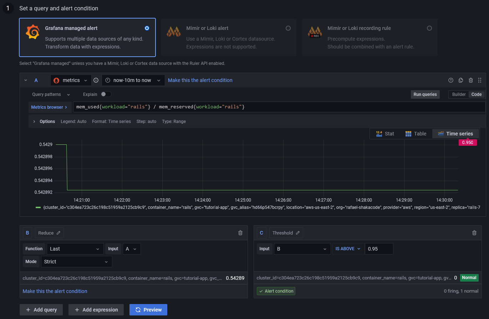
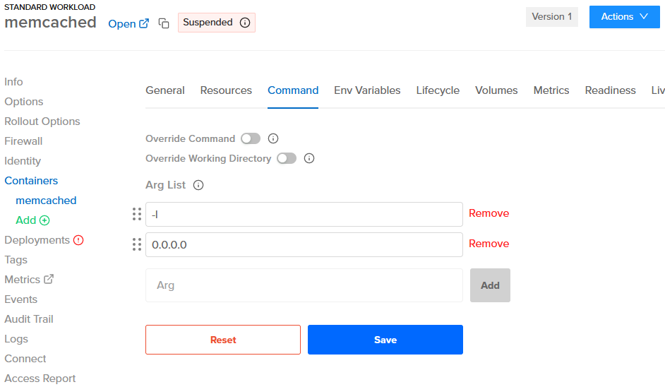
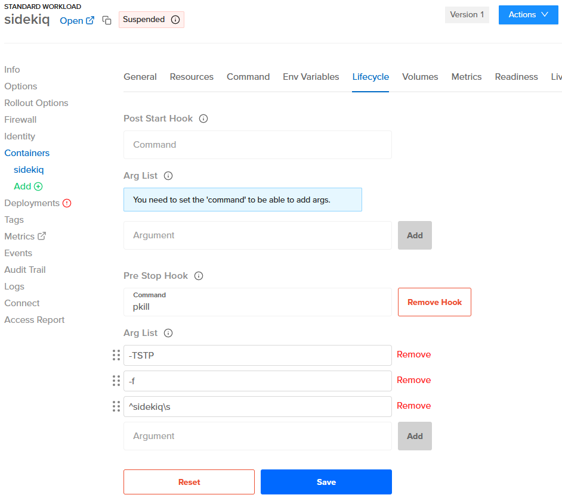

# Tips

1. [GVCs vs. Orgs](#gvcs-vs-orgs)
2. [Heroku Mappings](#heroku-mappings)
3. [RAM](#ram)
4. [CPU](#cpu)
5. [Remote IP](#remote-ip)
6. [Secrets and ENV Values](/docs/secrets-and-env-values.md)
7. [CI](#ci)
8. [Logs](#logs)
9. [Memcached](#memcached)
10. [Sidekiq](#sidekiq)
    - [Quieting Non-Critical Workers During Deployments](#quieting-non-critical-workers-during-deployments)
    - [Setting Up a Pre Stop Hook](#setting-up-a-pre-stop-hook)
    - [Setting Up a Liveness Probe](#setting-up-a-liveness-probe)
11. [Minimizing Review App Costs](#minimizing-review-app-costs)
    - [Scale the Web Workload to Zero](#scale-the-web-workload-to-zero)
    - [Delete or Pause Abandoned Apps with `cleanup-stale-apps`](#delete-or-pause-abandoned-apps-with-cleanup-stale-apps)
    - [Pause and Resume with `ps:stop` / `ps:start`](#pause-and-resume-with-psstop--psstart)
12. [Right-Sizing Non-Production Workloads](#right-sizing-non-production-workloads)
    - [Enable Capacity AI on Idle Workloads](#enable-capacity-ai-on-idle-workloads)
    - [Don't Autoscale Idle Workloads on CPU](#dont-autoscale-idle-workloads-on-cpu)
    - [Right-Size Reserved CPU and Memory](#right-size-reserved-cpu-and-memory)
    - [Drop Workloads You Don't Use](#drop-workloads-you-dont-use)
    - [Share One Postgres Across Non-Production Apps](#share-one-postgres-across-non-production-apps)
    - [Keep Templates as the Source of Truth](#keep-templates-as-the-source-of-truth)
13. [Useful Links](#useful-links)

## GVCs vs. Orgs

- A "GVC" roughly corresponds to a Heroku "app."
- Images are available at the org level.
- Multiple GVCs within an org can use the same image.
- You can have different images within a GVC and even within a workload. This flexibility is one of the key differences
  compared to Heroku apps.

## Heroku Mappings

If you're coming from Heroku, these concepts map roughly as follows:

| Heroku           | Control Plane                       |
| ---------------- | ----------------------------------- |
| App              | GVC                                 |
| Dyno             | Replica                             |
| Procfile Process | Workload                            |
| Config Var       | Secret / Environment Variable       |
| Add-on           | Managed Service or External Service |
| Release Phase    | Deployment Workflow                 |

These are conceptual equivalents rather than exact matches — see [GVCs vs. Orgs](#gvcs-vs-orgs) above for one key
difference. For a mapping of Heroku _CLI commands_ to `cpflow`/`cpln`, see
[Mapping of Heroku Commands](/README.md#mapping-of-heroku-commands-to-cpflow-and-cpln).

## RAM

Any workload replica that reaches the max memory is terminated and restarted. You can configure alerts for workload
restarts and the percentage of memory used in the Control Plane UX.

Here are the steps for configuring an alert for the percentage of memory used:

1. Navigate to the workload that you want to configure the alert for
2. Click "Metrics" on the left menu to go to Grafana
3. On Grafana, go to the alerting page by clicking on the alert icon in the sidebar
4. Click on "New alert rule"
5. In the "Set a query and alert condition" section, select "Grafana managed alert"
6. There should be a default query named `A`
7. Change the data source of the query to `metrics`
8. Click "Code" on the top right of the query and enter `mem_used{workload="workload_name"} / mem_reserved{workload="workload_name"} * 100`
   (replace `workload_name` with the name of the workload)
9. There should be a default expression named `B`, with the type `Reduce`, the function `Last`, and the input `A` (this
   ensures that we're getting the last data point of the query)
10. There should be a default expression named `C`, with the type `Threshold`, and the input `B` (this is where you
    configure the condition for firing the alert, e.g., `IS ABOVE 95`)
11. You can then preview the alert and check if it's firing or not based on the example time range of the query
12. In the "Alert evaluation behavior" section, you can configure how often the alert should be evaluated and for how
    long the condition should be true before firing (for example, you might want the alert only to be fired if the
    percentage has been above `95` for more than 20 seconds)
13. In the "Add details for your alert" section, fill out the name, folder, group, and summary for your alert
14. In the "Notifications" section, you can configure a label for the alert if you're using a custom notification policy,
    but there should be a default root route for all alerts
15. Once you're done, save and exit in the top right of the page
16. Click "Contact points" on the top menu
17. Edit the `grafana-default-email` contact point and add the email where you want to receive notifications
18. You should now receive notifications for the alert in your email



The steps for configuring an alert for workload restarts are almost identical, but the code for the query would be
`container_restarts`.

For more information on Grafana alerts, see: https://grafana.com/docs/grafana/latest/alerting/

## CPU

Control Plane workloads can be configured with CPU reservations and limits. If a workload consistently operates near its
CPU limit, request latency may increase. If CPU is configured as the workload's autoscaling metric (with `maxScale`
greater than `minScale`), Control Plane will add replicas in response — but the default `templates/rails.yml` pins
`minScale: 1`, `maxScale: 1`, so it holds a single replica until you configure autoscaling.

Worth monitoring:

- CPU utilization
- Request latency
- Replica count
- Container restarts

Consider configuring an alert for sustained CPU utilization above 80%. You can set this up with the same Grafana
alerting steps described under [RAM](#ram) above, substituting a CPU utilization query for the memory one.

## Remote IP

The actual remote IP of the workload container is in the 127.0.0.x network, so that will be the value of the
`REMOTE_ADDR` env var.

However, Control Plane additionally sets the `x-forwarded-for` and `x-envoy-external-address` headers (and others - see:
https://shakadocs.controlplane.com/concepts/security#headers). On Rails, the `ActionDispatch::RemoteIp` middleware should
pick those up and automatically populate `request.remote_ip`.

So `REMOTE_ADDR` should not be used directly, only `request.remote_ip`.

> **Warning:** Do not use `REMOTE_ADDR` for authentication, rate limiting, auditing, or IP allowlists. Always use
> framework-specific mechanisms that understand proxy headers (such as Rails' `request.remote_ip`).

## CI

**Note:** Docker builds much slower on Apple Silicon, so try configuring CI to build the images when using Apple
hardware.

Make sure to create a profile on CI before running any `cpln` or `cpflow` commands.

```sh
CPLN_TOKEN=...
cpln profile create default --token ${CPLN_TOKEN}
```

The `CPLN_TOKEN=...` line above is illustrative. In CI, don't write the literal token into your workflow file — store it
in your provider's secret store and let CI inject it as the `CPLN_TOKEN` environment variable, which
`cpln profile create ... --token ${CPLN_TOKEN}` then reads. See [`examples/circleci.yml`](/examples/circleci.yml) for the
recommended pattern.

Also, log in to the Control Plane Docker repository if building and pushing an image.

```sh
cpln image docker-login
```

## Logs

`cpflow logs` is a lightweight live-tail command. When you hit `cpln`/`cpflow` line-count or response-size limits, use
Grafana Loki's [`logcli`](https://grafana.com/docs/loki/latest/query/logcli/) directly against the Control Plane logs
endpoint for larger historical exports.

Install `logcli` with Homebrew when available:

```sh
brew install logcli
```

If Homebrew reports that the formula is unavailable, use Grafana's tap:

```sh
brew tap grafana/grafana
brew install grafana/grafana/logcli
```

For Linux, CI, or other environments without Homebrew, see the [`logcli` installation
docs](https://grafana.com/docs/loki/latest/query/logcli/getting-started/#install-logcli) for binary downloads or source
builds.

Configure it with your Control Plane org and current profile token:

```sh
export LOKI_ADDR=https://logs.cpln.io/logs/org/YOUR_ORG  # run `cpln org get` to find your org name
export LOKI_BEARER_TOKEN=$(cpln profile token)
```

`LOKI_BEARER_TOKEN` is a short-lived bearer credential (it typically expires after roughly 15–60 minutes). The
`$(cpln profile token)` capture above keeps the literal token out of shell history, but any later command that prints
it (`echo $LOKI_BEARER_TOKEN`, `env | grep LOKI`) will expose it; avoid those, don't commit the value to scripts, and
watch for it in CI logs. Rerun the token export if `logcli` returns a 401 or another authentication error.

Then query logs by label. A Control Plane app is a GVC, so set `gvc` to the app name and narrow by workload or other
labels as needed. The `--forward` flag returns results oldest-first (chronological), which is almost always what you
want for incident investigation or sequential reading; omit it to get the `logcli` default of newest-first:

```sh
logcli query '{gvc="my-app", workload="rails"}' --since 1h --limit 10000 --forward
```

For cleaner bulk exports, strip label metadata from each output line and redirect the output:

```sh
logcli query '{gvc="my-app", workload="rails"}' --since 24h --limit 50000 --no-labels --forward > rails.log
```

For historical incidents, use absolute UTC timestamps instead of a relative `--since` window:

```sh
logcli query '{gvc="my-app"}' \
  --from="2026-05-27T00:00:00Z" \
  --to="2026-05-27T06:00:00Z" \
  --limit 50000 \
  --no-labels \
  --forward > incident.log
```

`logcli` silently truncates results once `--limit` is reached, so a partial export looks the same as a complete one.
To check for truncation, compare line count to the limit: `wc -l < incident.log` near `--limit` means the export was
likely cut off. Prefer narrowing the time window (and concatenating the sub-ranges) over raising `--limit`, since the
server-side cap may be lower than the flag value.

## Memcached

On the workload container for Memcached (using the `memcached:alpine` image), configure the command with the args
`-l 0.0.0.0`.

This makes Memcached listen on all network interfaces so other workloads in the GVC can reach it at
`memcached.APP_GVC.cpln.local`. The `memcached` image already defaults to all interfaces, but passing `-l 0.0.0.0`
explicitly keeps the intent clear and guards against the listen address being restricted by a future base-image or
config change.

To do this:

1. Navigate to the workload container for Memcached
2. Click "Command" on the top menu
3. Add the args and save



## Sidekiq

### Quieting Non-Critical Workers During Deployments

To avoid locks in migrations, we can quiet non-critical workers during deployments. Doing this early enough in the CI
allows all workers to finish jobs gracefully before deploying the new image.

There's no need to unquiet the workers, as that will happen automatically after deploying the new image.

```sh
cpflow run 'rails runner "Sidekiq::ProcessSet.new.each { |w| w.quiet! unless w[%q(hostname)].start_with?(%q(criticalworker.)) }"' -a my-app
```

> **Note:** This assumes critical workers share a consistent hostname prefix (the check matches `hostname`, not
> Sidekiq's `tag` attribute). If you use a custom naming convention, adjust the `start_with?` check accordingly.

### Setting Up a Pre Stop Hook

By setting up a pre stop hook in the lifecycle of the workload container for Sidekiq, which sends "QUIET" to the workers,
we can ensure that all workers will finish jobs gracefully before Control Plane stops the replica. That also works
nicely for multiple replicas.

A couple of notes:

- We can't use the process name as regex because it's Ruby, not Sidekiq.
- We need to add a space after `sidekiq`; otherwise, it sends `TSTP` to the `sidekiqswarm` process as well, and for some
  reason, that doesn't work.

So with `^` and `\s`, we guarantee it's sent only to worker processes.

```sh
pkill -TSTP -f ^sidekiq\s
```

To do this:

1. Navigate to the workload container for Sidekiq
2. Click "Lifecycle" on the top menu
3. Add the command and args below "Pre Stop Hook" and save



### Setting Up a Liveness Probe

To set up a liveness probe on port 7433, see: https://github.com/arturictus/sidekiq_alive

## Minimizing Review App Costs

Long-tail review apps — PRs that linger for days or weeks with little traffic — can drive up Control Plane spend if every
workload runs full-time. `cpflow` already provides several knobs to manage this without custom orchestration.

> **Note:** Scaling workloads to zero or stopping review apps does not reduce costs from external databases, managed
> Redis instances, object storage, or other third-party services. Those continue to bill independently of Control Plane
> workload state.

### Scale the Web Workload to Zero

`templates/rails.yml` ships with `type: standard`, `minScale: 1`, `maxScale: 1`. That's a safe default for production,
but for review apps where cold-start latency is acceptable you can switch the web workload to a serverless type that
scales to zero replicas when idle. Apply the snippet below to your project's `.controlplane/templates/rails.yml`, or
create a review-app-specific template (for example `rails-review.yml`) and list it under `setup_app_templates` for the
review-app entry in `.controlplane/controlplane.yml`.

```yaml
# Only `type` and `minScale` change from templates/rails.yml; `maxScale`, `capacityAI` and `timeoutSeconds`
# are shown for context so the full `defaultOptions` block reaches the destination intact.
# Update the relevant fields in your full templates/rails.yml (or a review-app-specific template); keep
# containers, firewallConfig, identityLink, and everything else from that file intact.
kind: workload
name: rails
spec:
  type: serverless
  defaultOptions:
    autoscaling:
      minScale: 0
      maxScale: 1
    capacityAI: false    # keep your existing value
    timeoutSeconds: 60   # keep your existing value
```

See [`templates/rails.yml`](/templates/rails.yml) for the full default — `containers`, `firewallConfig`,
`identityLink`, and the other required fields must be preserved when you copy the snippet above.

Control Plane spins the workload back up on the next request. Only `type: serverless` workloads support `minScale: 0`;
`type: standard` always keeps at least one replica running.

Tradeoff: the first request after a quiet period pays the cold-start cost (typically 15–60 seconds for a Rails
image, depending on app size and boot configuration). For review apps that's usually fine; for production it
usually isn't.

> **Note:** if you later suspend the app with `cpflow ps:stop`, Control Plane will not auto-wake it on the next
> request. Run `cpflow ps:start` explicitly first. See
> [Pause and Resume](#pause-and-resume-with-psstop--psstart).

### Delete or Pause Abandoned Apps with `cleanup-stale-apps`

For PRs that are clearly done — merged, closed, or untouched for weeks — deleting beats scaling. Set
`stale_app_image_deployed_days` in `.controlplane/controlplane.yml`:

```yaml
my-app-review:
  match_if_app_name_starts_with: true
  stale_app_image_deployed_days: 14
```

Pick a threshold that fits your review cycle — 7 days can catch PRs still in QA; teams with longer review cycles often
use 14–30 days.

> **How staleness is measured:** `stale_app_image_deployed_days` uses the Control Plane image resource's `created`
> timestamp, typically when the image was pushed to Control Plane's registry. If no matching image exists, it falls back
> to the GVC's `created` timestamp. It does not consider last traffic or last PR comment.
> The same stale-app scan applies to both delete and stop modes below.

Then run in delete mode:

```sh
cpflow cleanup-stale-apps -a my-app-review --yes
```

The `--yes` flag skips the interactive confirmation prompt; keep it for CI jobs, or omit it when running manually and
you want to review the prompt. Because `match_if_app_name_starts_with: true` is set, `-a my-app-review` here matches
every app whose name starts with that prefix — by contrast, the `cpflow ps:stop -a my-app-review-123` examples below
target a single concrete app name.

This deletes the GVC, workloads, volumesets, and images for any review app whose latest matching image, or GVC when no
matching image exists, is older than the threshold. It also unbinds the app identity from the secrets policy when that
binding exists. Wire it into a nightly CI cron — see
[CI Automation — Generated Workflow Behavior](/docs/ci-automation.md#generated-workflow-behavior) for the
`cpflow-cleanup-stale-review-apps.yml` workflow, which runs in delete mode by default; customize the workflow
to pass `--mode=stop` if you prefer reversible pausing in CI.

For reversible idle handling under the same stale-app scan, use stop mode instead:

```sh
cpflow cleanup-stale-apps -a my-app-review --mode=stop --yes
```

This uses the same staleness threshold, but runs `cpflow ps:stop` for each stale app instead of deleting the GVC,
volumesets, or images. Resume an app later with `cpflow ps:start -a $APP_NAME`. `cpflow ps:stop` only suspends
workloads listed under `app_workloads` / `additional_workloads` in `.controlplane/controlplane.yml`; workloads
created outside that config (for example through the Control Plane UI) are left alone — see
[Pause and Resume](#pause-and-resume-with-psstop--psstart) for details.

### Pause and Resume with `ps:stop` / `ps:start`

For review apps you want to keep but pause — for example, a long-running QA branch a tester will come back to — suspend
all workloads with:

```sh
cpflow ps:stop -a my-app-review-123
```

This sets `defaultOptions.suspend: true` on every workload listed under `app_workloads` or `additional_workloads` in
`.controlplane/controlplane.yml`. Workloads created outside that config (for example through the Control Plane UI) are
left alone. Resume with:

```sh
cpflow ps:start -a my-app-review-123
```

No re-deploy is needed; the workloads come back with the same images they had before.

> **Note:** `ps:stop` overrides serverless auto-wake. If the web workload is already serverless (`minScale: 0`),
> suspending it sets `defaultOptions.suspend: true`, and Control Plane will not bring it back on the next request —
> `ps:start` must be run explicitly first.
>
> **Note:** Sidekiq, Postgres, Redis, and Memcached templates default to `type: standard` and `minScale: 1`, so they
> keep running while only the web tier sleeps. `cpflow ps:stop -a $APP_NAME` suspends every configured workload, web
> included, and `cleanup-stale-apps --mode=stop` applies the same pause behavior to stale review apps.

## Right-Sizing Non-Production Workloads

[Minimizing Review App Costs](#minimizing-review-app-costs) above targets ephemeral PRs.
Staging and demo apps — long-lived, low-traffic, and non-production — are the other common
source of avoidable Control Plane spend: they tend to keep generously-sized workloads
running full-time. The levers below apply to any non-production environment (staging,
demos, and review apps alike).

### Enable Capacity AI on Idle Workloads

Control Plane bills the CPU and memory a running replica *reserves*. With `minScale: 1` and
Capacity AI off, a workload reserves its full `cpu`/`memory` around the clock, even when the
app is idle. **Capacity AI** lets Control Plane right-size that reservation toward actual
usage, so an idle non-production workload costs a fraction of its ceiling.

Set it in `defaultOptions`:

```yaml
kind: workload
name: rails
spec:
  defaultOptions:
    capacityAI: true
```

Tradeoff: Control Plane reprovisions the replica when it adjusts the reservation. For
stateless web/renderer workloads that's negligible. For stateful workloads (Postgres,
Redis) a scale event briefly interrupts connections — fine for non-production, not for
production.

### Don't Autoscale Idle Workloads on CPU

CPU-utilization autoscaling adds nothing for an idle non-production app and works against
Capacity AI. Disable it and let Capacity AI handle right-sizing:

```yaml
spec:
  defaultOptions:
    capacityAI: true
    autoscaling:
      metric: disabled
      minScale: 1
      maxScale: 1
```

(For the web tier you can go further and scale to zero — see
[Scale the Web Workload to Zero](#scale-the-web-workload-to-zero).)

### Right-Size Reserved CPU and Memory

The shipped templates use production-leaning defaults. Check each workload's reserved
`cpu`/`memory` against its real usage — the workload's **Metrics** tab in Control Plane
shows Grafana CPU/memory graphs — because non-production workloads are routinely
over-provisioned.

Postgres is the usual offender: a demo or staging database does **not** need a full core.
Pinning `cpu: 1000m` keeps a whole reserved CPU running 24/7, while an idle Postgres
typically sits at single-digit millicores. Something like `cpu: 128m` / `memory: 1Gi` is
plenty for non-production:

```yaml
kind: workload
name: postgres
spec:
  containers:
    - name: postgres
      cpu: 128m
      memory: 1Gi
```

### Drop Workloads You Don't Use

Every workload listed under `app_workloads` / `additional_workloads` is another full-time
container. Remove the ones a non-production app doesn't actually need.

A common one is a separate background-job worker when the app has no jobs to run. On Rails
8, [Solid Queue](https://github.com/rails/solid_queue) can run inside Puma instead of as its
own workload — set `SOLID_QUEUE_IN_PUMA=true` (the default Rails 8 `config/puma.rb` starts
the Solid Queue supervisor when this is set). Then drop the `worker` workload from
`app_workloads` and `setup_app_templates` in `.controlplane/controlplane.yml`, and delete
its template. Solid Queue is database-backed, so this needs no Redis.

### Share One Postgres Across Non-Production Apps

Running a dedicated Postgres workload — and its SSD volume — for every staging and review
app multiplies standing cost. For non-production, several apps can share a single Postgres
server, each using its own database:

- Point each app's `DATABASE_HOST` (in `templates/app.yml`) at the shared instance's
  internal address, and give each app a distinct database name on that server.
- Expose the database port at **exactly one** level (org *or* GVC, never both) to avoid
  Control Plane routing conflicts.
- A Capacity AI scale event on a shared Postgres briefly interrupts every app pointed at
  it — acceptable for non-production.

A managed alternative is a single small RDS instance hosting many databases; see
[migrating from Heroku Postgres to RDS](https://pelle.io/posts/hetzner-rds-postgres).

### Keep Templates as the Source of Truth

It's tempting to tune `cpu`, `capacityAI`, or autoscaling directly in the Control Plane UI.
Don't: `cpflow deploy` reconciles every workload from your `.controlplane/templates/`, so
console edits are silently overwritten on the next deploy and your live configuration drifts
from the repo. Make cost changes in the templates and deploy them.

If you want drift caught automatically, manage long-lived environments with Terraform via
[`cpflow terraform`](/docs/terraform/overview.md) — `terraform plan` reports any difference
between the repo and live infrastructure before you apply.

## Useful Links

- For best practices for the app's Dockerfile, see: https://lipanski.com/posts/dockerfile-ruby-best-practices
- For migrating from Heroku Postgres to RDS, see: https://pelle.io/posts/hetzner-rds-postgres
